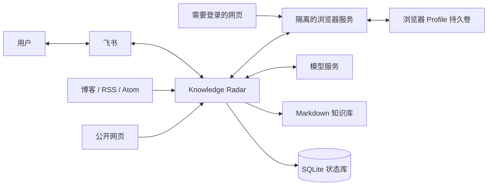
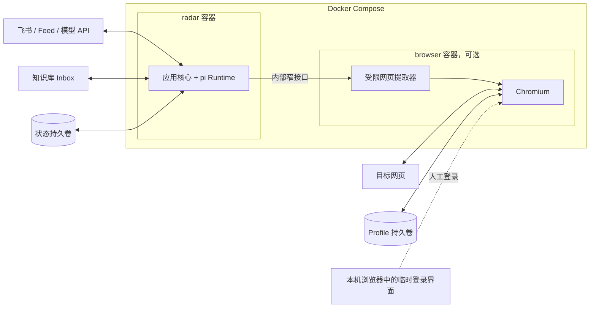
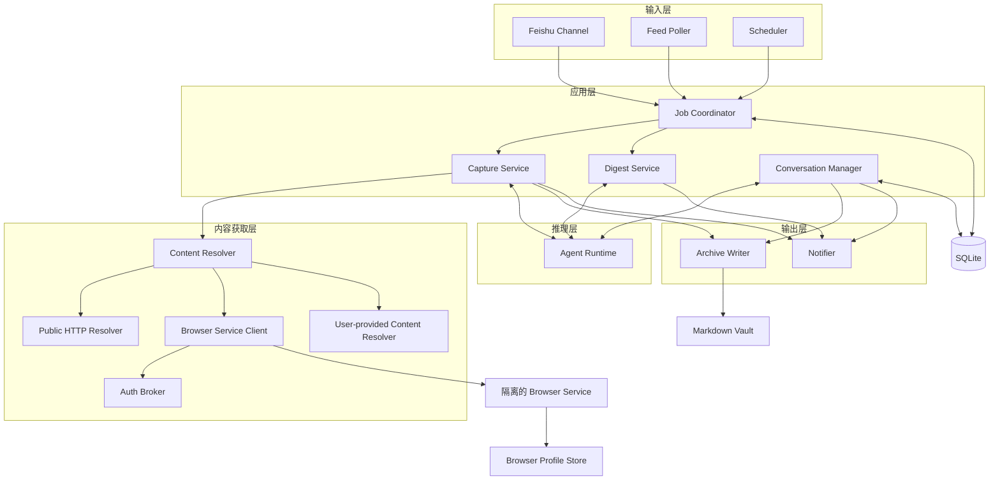
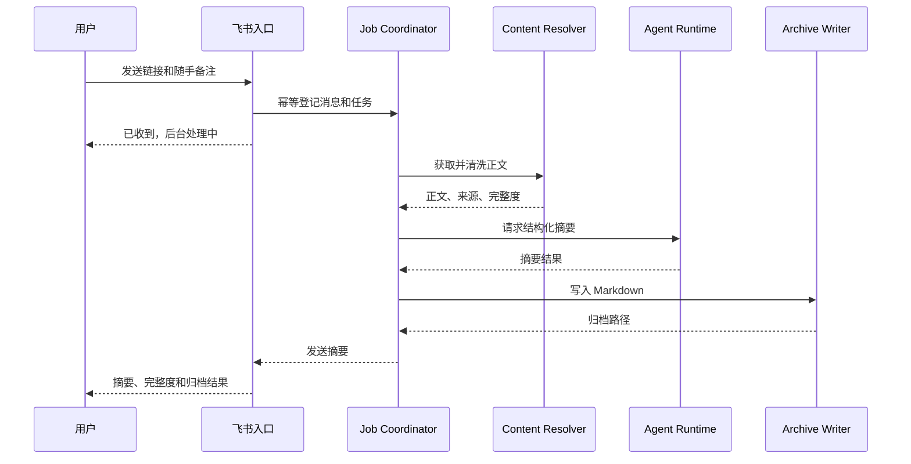
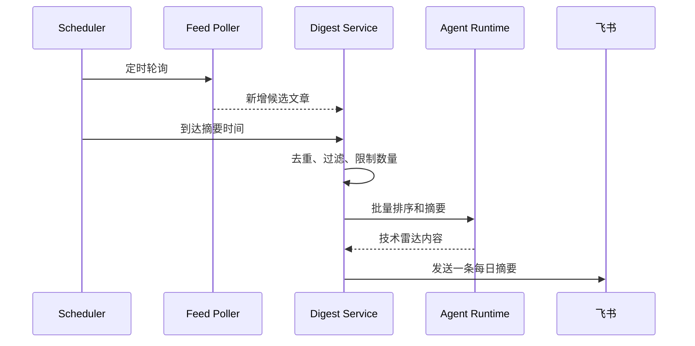
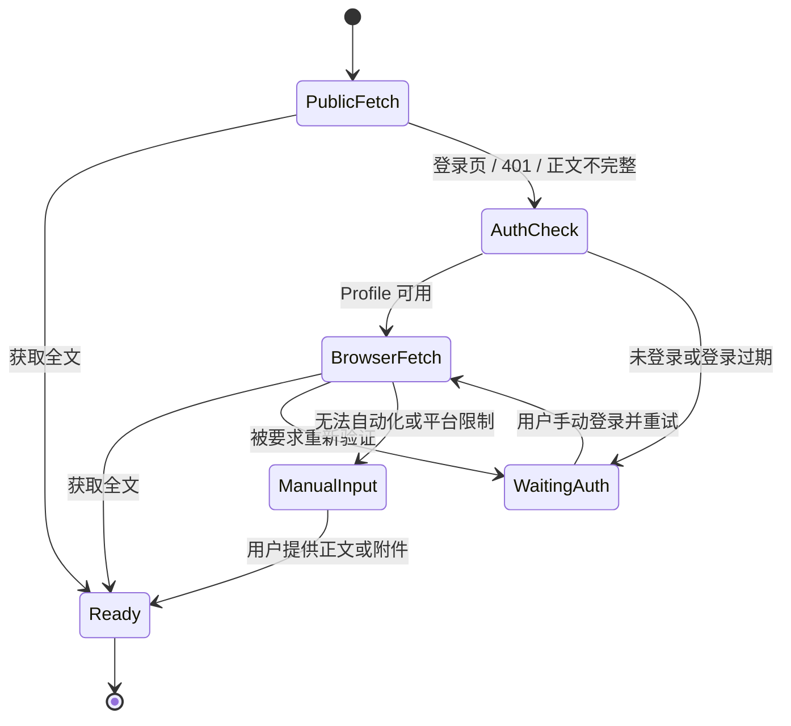

# 系统架构

## 1. 架构目标

Knowledge Radar 运行在一台长期在线的个人电脑上，服务单个用户。设计优先级依次是：

1. 可靠完成收件、总结、对话、归档和提醒闭环。
2. 保护网站登录态、飞书凭据和知识库内容。
3. 保持部署和维护简单，不引入不必要的基础设施。
4. 允许以后替换模型、消息渠道和内容提取器。

应用核心采用模块化单体：飞书、调度、任务编排、pi 和归档运行在同一个常驻进程中，通过清晰接口隔离。访问登录网页的浏览器拥有高价值 Cookie，又直接处理不可信页面，因此作为可选的隔离服务部署。这是安全边界，不是为了水平扩展而拆微服务。

## 2. 系统上下文



外部系统只通过适配器接入。领域流程不依赖飞书 SDK、pi SDK、Playwright 或具体数据库 API。

### 2.1 容器边界



`radar` 容器不获得 Browser Profile，`browser` 容器不获得知识库、飞书密钥和模型密钥。浏览器服务只接受来自 Compose 内部网络的受限请求，例如“使用指定 Profile 提取这个 URL”，不向 Agent 暴露通用 CDP、Playwright 或任意网页操作能力。

## 3. 逻辑组件



### 3.1 输入层

**Feishu Channel**

- 通过飞书长连接接收消息，不要求公网 IP 或 Webhook 域名。
- 只接受配置白名单中的用户。
- 收到事件后尽快完成幂等登记并返回，不在事件回调里等待抓取和模型调用。
- 把飞书消息转换为与 SDK 无关的内部消息格式。

**Feed Poller**

- 定时读取 RSS 和 Atom。
- 首次成功同步只建立基线，不把历史文章当作新增内容推送。
- 使用 feed URL、entry id、canonical URL 等信息去重。

**Scheduler**

- 按配置时区触发轮询和每日摘要。
- “合适的时间”第一阶段由用户配置，不交给模型猜测。
- 同一天的同一类计划任务只允许成功执行一次。

### 3.2 应用层

**Job Coordinator**

- 将消息和订阅更新转换为持久化任务。
- 管理领取、超时、重试和失败状态。
- 进程异常退出后能够从 SQLite 恢复未完成任务。

**Capture Service**

- 编排单篇文章的解析、总结、归档和回复。
- 不包含飞书、浏览器或模型供应商的具体实现。

**Digest Service**

- 汇总一个时间窗口内的新文章。
- 先根据标题、摘要、来源和兴趣配置做批量筛选，再抓取排名靠前的正文。
- 控制每日条数和模型成本，避免每次 RSS 更新都打断用户。

**Conversation Manager**

- 把飞书话题、回复关系或最近一次收件映射到文章会话。
- 持久化文章与安全的 Agent 上下文投影的关联。
- 将问答追加到同一份 Markdown，而不是生成散落的聊天日志。

### 3.3 内容获取层

`ContentResolver` 按下列顺序尝试获取内容：

```text
官方 API / 私有 Feed
→ 公开 HTTP 和页面内嵌数据
→ 已授权浏览器 Profile
→ 用户粘贴文本、附件或截图
```

每次获取必须返回来源和完整度：

| 字段 | 示例 |
| --- | --- |
| 获取方式 | `public_http`、`authenticated_browser`、`user_provided` |
| 完整度 | `full`、`partial`、`metadata_only` |
| 最终 URL | 跳转后的 canonical URL |
| 正文 | 清洗后的文本 |
| 证据 | 标题、作者、发布时间、抓取时间 |

当只获得摘要时，系统必须明确告诉用户，不能让模型表现得像读过全文。

其中 `Browser Service Client` 只是 `radar` 容器内的代理适配器，负责发送目标 URL、Profile 标识和提取约束。`Auth Broker` 只管理 Profile 元数据、健康状态和 `waiting_auth` 流程。真实 Cookie、Local Storage 和 Profile 文件始终留在隔离的 `browser` 容器持久卷中。

### 3.4 Agent Runtime

Agent Runtime 是一个可替换接口，默认实现使用 pi SDK。职责限定为：

- 根据可信指令和不可信文章正文生成结构化摘要。
- 维护围绕单篇文章的会话上下文。
- 为每日技术雷达提供排序理由和阅读建议。

Agent 默认没有 Shell、浏览器或任意文件写入工具。模型不能决定归档路径、读取 Cookie、发送飞书消息或发布博客。相关决定见 [ADR-0002](decisions/0002-keep-side-effects-outside-the-agent.md)。

### 3.5 输出层

**Archive Writer**

- 根据程序规则生成安全文件名和 Front Matter。
- 默认写入 `Private/Inbox/YYYY/MM/`。
- 原文默认不完整保存，归档摘要、必要摘录、用户备注和对话。
- 使用临时文件加原子替换，避免进程中断留下半份文档。

**Notifier**

- 负责飞书确认、处理结果、失败提示和每日摘要。
- 对发送失败进行有限重试。
- 使用 Outbox 状态避免任务成功但通知丢失。

## 4. 关键流程

### 4.1 飞书链接收件



同一飞书 `message_id` 只能创建一次任务。同一 canonical URL 可以再次讨论，但不重复创建原始归档。

### 4.2 每日技术雷达



若当天没有新增内容，不发送空摘要。

### 4.3 登录态网页



默认方案是一站一个低权限阅读账号和一个独立 Profile。系统不批量注册、轮换账号或规避封禁。详细决定见 [ADR-0003](decisions/0003-session-first-authentication.md)。

## 5. 数据边界

| 数据 | 存放位置 | 是否进入 Git |
| --- | --- | --- |
| 公开配置示例 | 项目仓库 | 是 |
| Feed 地址和兴趣标签 | 本地配置 | 视内容而定 |
| 飞书 App Secret、模型密钥 | 系统凭据或环境变量 | 否 |
| 消息幂等、任务、订阅游标 | SQLite | 否 |
| Agent 上下文投影 | SQLite | 否 |
| 浏览器 Cookie 和 Local Storage | 独立 Browser Profile | 否 |
| 摘要、用户备注和对话 | Markdown 知识库 | 由知识库策略决定 |
| 完整第三方原文 | 默认不保存 | 否 |

SQLite 保存运行状态，不承担长期知识库职责。删除 SQLite 不应导致已经归档的知识资产丢失。

会话、轮次、任务、Outbox 的状态边界、恢复规则和验收场景见[会话运行时与可恢复状态机](conversation-runtime.md)。

## 6. 概念数据模型

| 实体 | 用途 |
| --- | --- |
| `inbound_messages` | 飞书消息幂等和处理状态 |
| `jobs` | 持久化任务、重试次数和错误原因 |
| `feeds` | Feed 配置、初始化和最后检查时间 |
| `feed_entries` | 文章去重、发现时间和通知状态 |
| `captures` | URL、标题、摘要和归档路径 |
| `conversations` | 飞书会话、文章和 Agent 上下文投影之间的映射 |
| `outbox` | 等待发送或需要重试的飞书消息 |
| `auth_profiles` | Profile 标识、允许域名和健康状态，不保存 Cookie |

任务状态至少包括：

```text
pending → processing → completed
                   ↘ retry_wait → processing
                   ↘ waiting_auth → processing
                   ↘ failed
```

## 7. 安全设计

### 7.1 提示词注入

网页正文始终是不可信输入。正文与系统指令分区传给模型，Agent 不拥有高风险工具，模型输出经过结构校验后才能进入归档和消息模板。

### 7.2 SSRF

用户提交的 URL 必须限制为 HTTP/HTTPS，并在每次跳转前解析目标地址，阻止环回、链路本地、私网和云元数据地址。确需访问内网时只能显式配置域名白名单。

### 7.3 登录凭据

- 不复用日常浏览器主 Profile。
- Browser Profile 放在项目和知识库之外。
- Profile、Cookie 和认证状态不进入 Git、日志或模型上下文。
- 登录默认由用户在可见浏览器中完成。
- 一个 Profile 同时只允许一个浏览器实例使用。

### 7.4 权限和发布

- 飞书入口默认仅允许指定 `open_id`。
- 归档默认进入 Hugo 不会发布的 `Private` 区域。
- Agent 没有移动内容到 `Public`、执行 Git 提交或推送的权限。

### 7.5 容器安全边界

- 两个服务都以非 root 用户运行，启用 `no-new-privileges` 并删除不需要的 Linux capabilities。
- 根文件系统只读，仅将状态、归档和 Profile 挂到各自需要的位置。
- `radar` 只读挂载配置，只读写知识库的 Inbox 子目录，不挂载整个 `MyKnowledgeBase`。
- `browser` 只挂载自己的 Profile 持久卷，不接触知识库和业务密钥。
- 不使用 `privileged`、宿主网络，也不挂载 Docker Socket。
- 服务端口默认不发布到宿主机；本机人工登录模式仅在需要时启动并绑定 `127.0.0.1`。
- 手机免安装的远程登录只能通过显式启用的身份代理和出站隧道访问，并且只暴露临时登录界面，不暴露内部抓取 API。
- 设置 CPU、内存、进程数和临时空间上限，防止异常页面耗尽主机资源。

Docker 缩小了进程能够访问的文件和权限范围，但不是绝对安全边界。只要把宿主目录以读写方式挂入容器，容器就拥有修改该目录的能力，因此挂载范围必须保持最小。

### 7.6 远程人工登录

默认仍使用本机登录，不创建公网入口。用户明确启用远程登录后，系统通过额外 Compose overlay 启动空闲的 `browser-login` 和出站隧道服务：

```text
飞书一次性链接
→ Cloudflare Access 身份校验
→ Cloudflare Tunnel
→ browser-login 临时会话
→ 指定 Browser Profile
```

这条链路不要求手机安装额外客户端，也不在路由器或宿主机上开放入站端口。公网只能到达登录界面；隧道所在网络不能访问 `radar`、SQLite、知识库或浏览器内部抓取接口。

每个登录链接必须使用高强度随机令牌，并绑定飞书用户、站点、Profile 和任务，单次使用且短时过期。Access 身份校验与业务令牌必须同时通过。登录成功、超时或连续失败后立即关闭远程会话，但不让 Agent 获得 Docker Socket、密码或 Cookie。

## 8. 可靠性和可观测性

- 所有外部事件先持久化再异步处理。
- 抓取、模型调用和飞书发送使用独立超时与有限重试。
- 错误记录阶段、URL、尝试次数和可操作原因，不记录正文与凭据。
- 日志使用结构化格式，并带有 `message_id`、`job_id`、`capture_id`。
- 提供健康状态：飞书连接、最后 Feed 轮询、积压任务数、等待登录任务数。
- 进程停止时停止领取新任务，并允许当前任务在限定时间内结束。

## 9. 部署形态

正式部署目标是 Docker Compose，运行在 Windows Docker Desktop 或 Linux Docker Engine：

- `radar`：默认启动的应用核心，维持飞书长连接并执行后台任务。
- `browser`：登录网页功能启用后启动的隔离浏览器服务。
- `browser-login`：按需启动的人工登录入口，复用 `browser` 的 Profile 持久卷，不作为常驻服务。

启用手机远程登录时，`browser-login` 可以由显式的 Compose overlay 以空闲模式常驻，由内部受限请求创建临时会话；这不会授权 `radar` 管理 Docker。外部隧道同样属于可选 overlay，不进入默认部署。

SQLite 使用 Docker named volume；知识库 Inbox 使用宿主机 bind mount；浏览器状态使用独立 named volume；密钥通过 Compose secrets 只授予 `radar`。Compose 使用 `restart: unless-stopped` 管理异常重启，不再依赖 Windows 任务计划程序启动应用进程。

容器、挂载和登录操作的详细设计见[Docker 部署设计](deployment.md)。

## 10. 扩展点

以下能力通过新适配器增加，不改变核心流程：

- 新消息渠道：Telegram、微信文件助手替代入口、邮件。
- 新内容类型：PDF、图片 OCR、视频字幕。
- 新模型运行时：直接模型 API、本地模型或其他 Agent 框架。
- 新归档目标：Notion、飞书文档、数据库。
- 新 Feed 类型：GitHub Releases、arXiv 查询、邮件 Newsletter。
