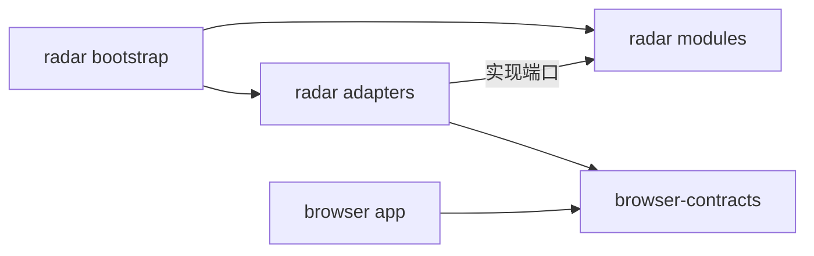

# 仓库结构设计

## 1. 结论

Knowledge Radar 使用一个 Git 仓库和 npm workspaces 管理两个可部署应用：

- `apps/radar`：飞书入口、任务编排、Agent、SQLite 和 Markdown 归档。
- `apps/browser`：隔离的 Playwright/Chromium 内容提取与人工登录能力。
- `packages/browser-contracts`：两个应用之间唯一共享的网络协议定义。

这仍然是一个轻量项目。workspaces 用来隔离依赖和构建产物，不代表要拆成大量微服务或发布多个 npm 包。npm 原生支持从根目录管理多个本地 package，不需要再引入 monorepo 编排工具。[npm workspaces 文档](https://docs.npmjs.com/cli/using-npm/workspaces/)

目录按业务职责和安全边界划分，不按第三方框架划分。`pi`、飞书、Playwright 和 SQLite 都只是适配器，不能成为业务目录的中心。

## 2. 当前真实目录

仓库目前仍处于设计阶段，真实目录只有文档：

```text
knowledge-radar/
├── README.md
└── docs/
    ├── architecture.md
    ├── deployment.md
    ├── project-structure.md
    ├── roadmap.md
    ├── technology-selection.md
    └── decisions/
        ├── 0001-use-pi-sdk-behind-an-interface.md
        ├── 0002-keep-side-effects-outside-the-agent.md
        ├── 0003-session-first-authentication.md
        ├── 0004-containerized-deployment.md
        └── 0005-organize-as-npm-workspaces.md
```

下面的目标树是未来实现时的放置规则，不表示这些文件已经创建。

## 3. 目标目录树

```text
knowledge-radar/
├── apps/
│   ├── radar/
│   │   ├── src/
│   │   │   ├── main.ts
│   │   │   ├── bootstrap/
│   │   │   ├── config/
│   │   │   ├── modules/
│   │   │   │   ├── auth/
│   │   │   │   ├── capture/
│   │   │   │   ├── conversation/
│   │   │   │   ├── digest/
│   │   │   │   ├── feeds/
│   │   │   │   ├── jobs/
│   │   │   │   └── notification/
│   │   │   ├── adapters/
│   │   │   │   ├── agent/pi/
│   │   │   │   ├── archive/markdown/
│   │   │   │   ├── browser/
│   │   │   │   ├── content/public-http/
│   │   │   │   ├── database/sqlite/
│   │   │   │   ├── feishu/
│   │   │   │   ├── observability/pino/
│   │   │   │   └── scheduling/croner/
│   │   │   └── shared/
│   │   ├── migrations/
│   │   ├── prompts/
│   │   ├── test/integration/
│   │   ├── package.json
│   │   └── tsconfig.json
│   └── browser/
│       ├── src/
│       │   ├── entrypoints/
│       │   │   ├── fetch-service.ts
│       │   │   └── login-service.ts
│       │   ├── bootstrap/
│       │   ├── config/
│       │   ├── modules/
│       │   │   ├── extraction/
│       │   │   ├── login/
│       │   │   └── profiles/
│       │   ├── adapters/
│       │   │   ├── http/
│       │   │   ├── playwright/
│       │   │   └── observability/pino/
│       │   └── security/
│       ├── test/integration/
│       ├── package.json
│       └── tsconfig.json
├── packages/
│   └── browser-contracts/
│       ├── src/
│       │   ├── fetch.ts
│       │   ├── login-session.ts
│       │   └── errors.ts
│       ├── package.json
│       └── tsconfig.json
├── tests/
│   ├── e2e/
│   └── fixtures/
│       ├── feeds/
│       └── pages/
├── config/
│   └── config.example.yml
├── docker/
│   ├── radar.Dockerfile
│   ├── browser.Dockerfile
│   └── chromium-seccomp.json
├── scripts/
├── docs/
│   ├── decisions/
│   └── runbooks/
├── .github/
│   └── workflows/
├── .dockerignore
├── .gitignore
├── compose.yaml
├── compose.remote-login.yaml
├── package.json
├── package-lock.json
├── tsconfig.base.json
├── LICENSE
├── SECURITY.md
├── CONTRIBUTING.md
└── README.md
```

首个可运行版本不会一次性创建整棵树。只有某个阶段真正需要的目录才落盘，避免大量空目录和占位文件。

## 4. 应用内部如何划分

### `apps/radar`

`radar` 是模块化单体，一个进程内完成主要业务，但模块之间保持清晰边界。

| 目录 | 职责 |
| --- | --- |
| `main.ts` | 进程入口，只调用 bootstrap，不放业务规则 |
| `bootstrap/` | 创建对象、连接依赖、启动和优雅停止 |
| `config/` | 加载配置并使用 Zod 校验，不保存实际密钥 |
| `modules/` | 用例、业务状态和由业务声明的端口接口 |
| `adapters/` | 飞书、pi、SQLite、HTTP、Markdown 等具体实现 |
| `shared/` | 少量与业务无关的 ID、时间、错误等基础类型 |
| `migrations/` | 按顺序执行且不可静默修改的 SQLite 迁移 |
| `prompts/` | 经过版本控制的系统提示词模板，不存网页正文和对话 |

`modules/` 按能力而不是技术拆分。例如，`capture` 负责“取得一篇文章并归档”这个用例；它可以声明 `ContentResolver`、`AgentRuntime` 和 `ArchiveWriter` 端口，但不知道这些端口最终由 HTTP、pi 或 Markdown 实现。

飞书既接收入站消息又发送通知，相关 SDK 封装统一放在 `adapters/feishu/`。这样飞书事件结构不会扩散到业务模块。

### `apps/browser`

浏览器应用属于独立安全域，不引用 `apps/radar` 的源码。它包含两个启动入口：

- `fetch-service.ts`：Compose 中的 `browser` 服务，提供受限正文提取接口。
- `login-service.ts`：Compose 中的 `browser-login` 服务，提供临时可见浏览器。

两个入口复用 Profile 管理和 Playwright 代码，并构建为同一浏览器镜像。它们不能同时打开同一个 Profile。

手机免安装的远程登录在 Phase 4 通过 `compose.remote-login.yaml` 显式增加受 Access 保护的隧道。该文件只编排官方隧道镜像，不在仓库中复制第三方源码，也不把浏览器内部抓取 API 暴露出去。

### `packages/browser-contracts`

这个 package 只包含跨容器协议：请求、响应、错误码和运行时校验 schema。类型应从 schema 推导，避免 TypeScript 类型正确而实际网络数据错误。

协议中可以出现目标 URL、Profile ID、正文和完整度，但永远不能出现 Cookie、密码、Local Storage、任意脚本或宿主文件路径。它不能依赖任一应用。

第一阶段不创建其他共享 package。代码只有在被至少两个 workspace 实际使用、含义稳定且不扩大权限边界时，才允许从应用中提取。

## 5. 依赖方向



必须遵守：

- `modules` 不导入 `adapters`、飞书 SDK、pi SDK、Playwright 或 SQLite 实现。
- `bootstrap` 是唯一同时了解业务端口和具体适配器的地方。
- `apps/browser` 不导入 `apps/radar`，两个进程只通过内部 HTTP 协议通信。
- `packages/browser-contracts` 不读取环境变量、不访问网络、不包含业务流程。
- Agent 适配器不能直接调用飞书、文件系统或浏览器；副作用仍由普通程序编排。
- 禁止循环依赖；跨模块调用应经过明确导出的服务或端口。

## 6. 测试放置规则

| 测试类型 | 位置 | 原则 |
| --- | --- | --- |
| 单元测试 | 与源码相邻的 `*.test.ts` | 测纯规则和单个模块，避免跨目录寻找 |
| 应用集成测试 | `apps/*/test/integration/` | 使用临时 SQLite、本地 HTTP 服务或临时 Profile |
| 协议测试 | `packages/browser-contracts/src/*.test.ts` | 验证双方对请求、响应和错误码理解一致 |
| 端到端测试 | `tests/e2e/` | 启动 Compose，验证跨应用闭环 |
| 测试素材 | `tests/fixtures/` | 只放自制或可合法再分发的脱敏页面和 Feed |

真实 Cookie、真实飞书消息、模型完整响应和第三方文章全文都不能作为 fixture 提交。

## 7. Docker 文件如何映射到源码

| Compose 服务 | 源码 | 镜像 |
| --- | --- | --- |
| `radar` | `apps/radar` + `packages/browser-contracts` | `radar.Dockerfile` |
| `browser` | `apps/browser` + `packages/browser-contracts` | `browser.Dockerfile` |
| `browser-login` | 与 `browser` 相同，使用另一 entrypoint | `browser.Dockerfile` |
| 远程登录隧道 | 无项目源码，使用固定版本的供应商镜像 | 由 `compose.remote-login.yaml` 增加 |

基础部署放在根目录 `compose.yaml`，因为这是用户最容易发现的标准入口。远程登录使用显式 overlay，不命名为会被 Compose 自动加载的 `compose.override.yaml`，避免无意中开启远程入口。Docker Compose 支持按命令行顺序合并多个文件，且相对路径以第一个 Compose 文件为基准。[Compose 多文件文档](https://docs.docker.com/compose/how-tos/multiple-compose-files/merge/)

两个 Dockerfile 都使用多阶段构建，只把对应应用的运行产物和生产依赖放进最终镜像。仓库根目录作为构建上下文时，`.dockerignore` 必须排除 Git、测试输出、本地配置、SQLite、Profile、日志和任何 secret。

## 8. 配置与运行数据不属于仓库树

仓库中的 `config/config.example.yml` 只展示字段和安全默认值。实际部署使用的配置和 secrets 放在仓库之外，通过 Compose 变量指定绝对路径。

```text
D:/Desktop/knowledge-radar                  # 公开源码和文档
D:/Desktop/MyKnowledgeBase/Private/Inbox    # 唯一知识库读写挂载
Docker volume: radar-state                  # SQLite 和任务状态
Docker volume: browser-profiles-low-risk    # 低权限账号登录态
宿主机受限目录                              # 实际 config 和 secrets
```

项目内不创建 `data/`、`profiles/` 或 `secrets/` 作为正式运行位置。即使这些目录被 `.gitignore`，也容易被误打包、误备份或加入 Docker 构建上下文。

## 9. 命名与新增代码规则

- 目录和文件使用 `kebab-case`，TypeScript 类型使用 `PascalCase`。
- 端口接口使用 `*.port.ts`，适配器使用表达具体技术的名称，不使用含糊的 `impl`。
- 单元测试使用 `*.test.ts`，数据库迁移使用递增编号且一经发布不回写。
- 避免到处建立 `index.ts` barrel；从明确文件导入可以减少循环依赖和隐藏耦合。
- 不建立无限扩张的 `utils/`、`helpers/`、`common/` 或 `base/` 目录。
- 新内容来源优先增加 Content Resolver 适配器，新模型优先增加 Agent Runtime 适配器。
- 只有出现新的进程生命周期或安全边界时才新增 `apps/*`。
- 管理后台、CLI、更多共享 package 都等到真实需求出现后再建立。

## 10. 为什么不采用其他树形

**所有代码放进一个 `src/`**：初期文件少，但会模糊 `radar` 与浏览器的依赖、镜像和密钥边界。

**每个逻辑组件一个服务**：会为 Capture、Digest、Scheduler 等引入重复配置、网络协议和部署成本，不适合个人单机项目。

**提前建立大量共享包**：容易把 Cookie、模型或数据库类型跨边界传播，也会让简单修改跨越多个 package。

**fork pi 到仓库中**：会混淆项目代码与上游实现，并承担不必要的同步和安全维护成本。

这套结构的目标不是追求形式上的整洁，而是让维护者看到文件路径时，就能判断它属于哪个进程、拥有哪些权限、可以依赖谁以及应该如何测试。
